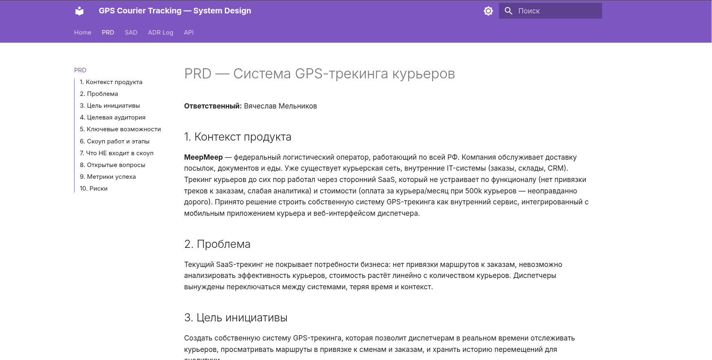

# GPS Courier Tracking — System Design

Архитектурное проектирование системы GPS-трекинга курьеров для федерального сервиса доставки.

Учебный проект в рамках курса **System Design**. Выполнен как полноценный архитектурный пакет: PRD, SAD, ADR, OpenAPI-спецификации.

## Документация

Документы можно читать прямо на GitHub:

| Документ | Описание |
|----------|----------|
| [PRD](PRD.md) | Product Requirements Document — бизнес-требования, скоуп, метрики |
| [SAD](SAD.md) | Solution Architecture Document — архитектура, расчёты, мониторинг |
| [ADR Log](adr/) | Architecture Decision Records — обоснование ключевых решений |
| [API Reference](api.md) | Обзор API (Courier API + Operator API) |
| [Courier API](courier-api.md) | OpenAPI-спецификация мобильного API курьера |
| [Operator API](operator-api.md) | OpenAPI-спецификация API оператора |

## Локальный сайт (MkDocs Material)

Для лучшего визуального представления проекта рекомендуем запустить сайт локально — навигация, поиск, Swagger UI для API-спецификаций.



**Требования:** Docker и Docker Compose.

```bash
git clone https://github.com/ua6xh/gps-tracking-system-design.git
cd gps-tracking-system-design
docker compose up -d
```

Сайт будет доступен на [http://localhost:8000](http://localhost:8000). Изменения в файлах подхватываются автоматически (hot-reload).

Остановить:

```bash
docker compose down
```
