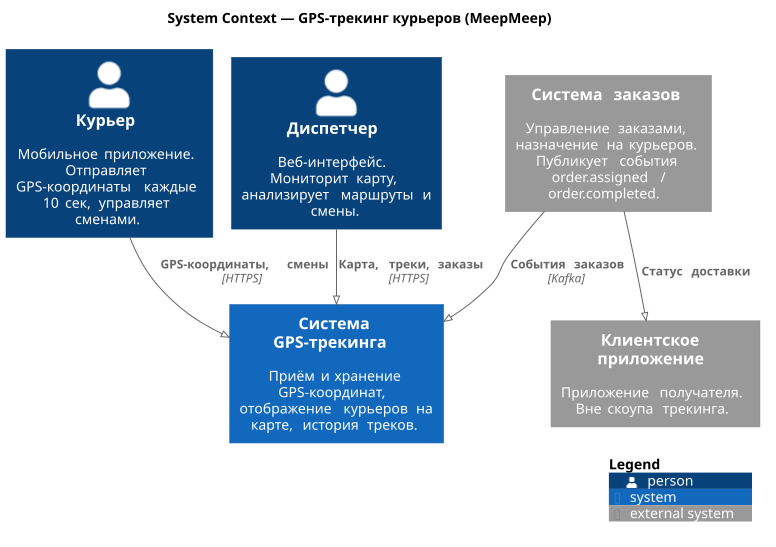
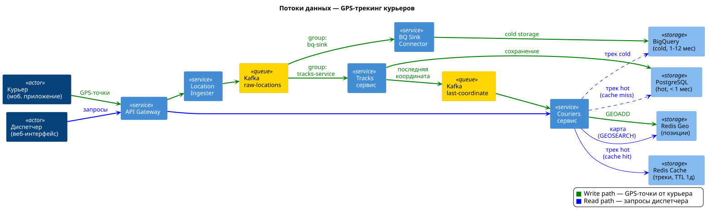

# SAD — Solution Architecture Document — Система GPS-трекинга курьеров

## 1. Общая информация

**Название:** Система GPS-трекинга курьеров

**Ответственный:** Вячеслав Мельников

## 2. Цель

Обеспечить отслеживание курьеров в реальном времени и хранение истории перемещений для федерального сервиса доставки.

## 3. Контекст

**MeepMeep** — федеральный логистический оператор, работающий по всей РФ (11 часовых поясов). Курьерская сеть охватывает всю страну — система работает круглосуточно, т.к. когда в Москве ночь, во Владивостоке уже рабочий день. Курьеры (мобильное приложение) отправляют GPS-координаты, диспетчеры (веб-интерфейс) мониторят карту и анализируют маршруты. Система заказов и клиентское приложение уже существуют — трекинг интегрируется с ними через внутренние API.

**Ключевые заинтересованные стороны:** диспетчерская служба, операционный отдел, команда системы заказов (интеграция, этап 2).

**Основные архитектурные драйверы (ASR):**

- Write-heavy система (20k RPS запись vs ~1k RPS чтение)
- Staleness < 1 мин
- Availability 99.99%
- Хранение истории 1 год (~95 ТБ)
- Эластичность под пиковые нагрузки (x3)

## 4. Архитектура решения

### 4.1. Основные компоненты и интеграции

**Сервисы:**

- **API Gateway + Load Balancer** — точка входа, маршрутизация, rate limiting
- **Location Ingester** — тонкий stateless сервис на входе write-path. Валидация + запись в Kafka. Не ходит в БД, защищает pipeline от потери данных при перегрузке Tracks сервиса
- **Tracks сервис** — потребление GPS-точек из Kafka, хранение треков в PostgreSQL, публикация последней координаты в Kafka
- **Couriers сервис** — профили курьеров, статусы, смены, отдача треков (роутинг между hot/cold хранилищами)

**Хранилища:**

- **Redis Geo** — текущие позиции курьеров (GEOADD/GEOSEARCH), hot data для карты
- **Redis Cache** — кэш завершённых треков (STRING, TTL 1 день)
- **PostgreSQL (Tracks)** — GPS-точки за последний месяц, партиционирование по месяцам, async-репликация (Kafka = source of truth), master + 2 реплики
- **PostgreSQL (Couriers)** — профили, смены, метаданные, semi-sync репликация (1 sync + 1 async)
- **BigQuery** — холодные треки (1-12 месяцев), данные поступают параллельно из Kafka через BigQuery Sink Connector

**BigQuery Sink Connector** (Kafka Connect) — отдельный consumer group (`bq-sink`) на топике `raw-locations`, пишет GPS-точки напрямую в BigQuery. Данные попадают в BigQuery параллельно с PostgreSQL, перекладка не нужна.

**Kafka** (RF=3, 3 брокера):

| Топик | Партиции | Ключ | Producer | Consumer (group) | acks | Retention |
|---|---|---|---|---|---|---|
| `raw-locations` | 64 | courier_id | Location Ingester | Tracks сервис (`tracks-service`), BQ Sink Connector (`bq-sink`) | 1 | 7 дней |
| `last-coordinate` | 16 | courier_id | Tracks сервис | Couriers сервис (`couriers-service`) | 1 | 24 часа |

- **Ключ courier_id** — точки одного курьера всегда в одной партиции, порядок гарантирован
- **acks=1** — лидер партиции подтвердил запись. Компромисс: скорость при 20k RPS, потеря единичных точек при падении лидера допустима (клиент пришлёт повторно)
- **Micro-batching** — consumer Tracks сервиса забирает пачку сообщений из `raw-locations` за один `poll()`, формирует multi-row INSERT в PostgreSQL
- **Consumer rebalance** — при падении инстанса consumer'а его партиции автоматически перераспределяются между оставшимися
- **Два consumer group на `raw-locations`** — `tracks-service` пишет в PG (hot), `bq-sink` пишет в BigQuery (cold). Consumer groups читают один топик независимо, каждый хранит свой offset
- **Kafka vs RabbitMQ** — Kafka выбрана как append-only лог событий: replay, несколько consumer groups на одном топике, высокий throughput. RabbitMQ — task queue (задача удаляется после ack), не подходит для потока GPS-данных

### 4.2. Системный контекст (C4)

### 4.3. Потоки данных

**Write path** (зелёный) — GPS-точки от курьера через Location Ingester попадают в Kafka (`raw-locations`). Далее два независимых consumer group'а обрабатывают данные параллельно:

- **Tracks сервис** (`tracks-service`) — сохраняет в PostgreSQL (hot storage), публикует последнюю координату в `last-coordinate`
- **BigQuery Sink Connector** (`bq-sink`) — пишет напрямую в BigQuery (cold storage)

Couriers сервис потребляет `last-coordinate` и обновляет Redis Geo. Точки с `accuracy > 100м` игнорируются — на карте остаётся последняя хорошая позиция. В PG данные сохраняются все (для полноты истории).

**Read path** (синий) — запросы диспетчера через API Gateway к Couriers сервису, который роутит по сценарию:

- **Карта** — Redis GEOSEARCH, polling каждые 5 сек
- **Трек смены (hot, < 1 мес)** — Redis Cache (hit) или PostgreSQL slave (miss → кэш)
- **Трек смены (cold, 1–12 мес)** — BigQuery

Роутинг hot/cold по дате начала смены. Два адаптера за единым интерфейсом. Hot window фактически 1-2 месяца (помесячные партиции — данные за начало месяца живут до дропа в следующем). Если смена старше последней живой партиции — роутинг в BigQuery.

**Lifecycle партиций** — партиции создаются заранее на 3 месяца вперёд (запас при сбое cron). Одновременно живут: текущая + прошлый месяц + 3 будущих. Cron job раз в месяц: (1) создаёт следующую партицию, (2) выполняет `DROP PARTITION` для партиций старше 1 месяца. DROP PARTITION — мгновенная операция (O(1)), в отличие от DELETE который сканирует и помечает строки. Pre-check: перед дропом проверяется consumer lag группы `bq-sink` — если lag > 0, дроп не выполняется и срабатывает алерт. Это гарантирует, что данные доехали в BigQuery.

### 4.4. API-контракты

Полная спецификация — [OpenAPI (Swagger UI)](api.md). Ниже — сводная таблица.

Два API с разной стратегией версионирования:

- **Courier API** (`/api/v1/courier/...`) — мобильное приложение. Версионируется, т.к. мобильные клиенты нельзя принудительно обновить.
- **Operator API** (`/api/operator/...`) — веб-интерфейс. Без версионирования, т.к. веб всегда на актуальной версии.

Аутентификация: Courier API — `X-Api-Token` (courier_id из токена), Operator API — JWT в httpOnly cookie.

#### Courier API (мобильное приложение)

| Метод | Эндпоинт | Назначение |
|-------|----------|------------|
| POST | `/api/v1/courier/shifts` | Открыть смену (идемпотентный ключ) |
| DELETE | `/api/v1/courier/shifts/{shiftId}` | Закрыть смену |
| POST | `/api/v1/courier/locations` | Отправить GPS-координату |
| POST | `/api/v1/courier/locations/batch` | Отправить буфер GPS-координат (до 100 шт) |

#### Operator API (веб-интерфейс)

| Метод | Эндпоинт | Назначение |
|-------|----------|------------|
| GET | `/api/operator/map/couriers?lat1&lng1&lat2&lng2` | Курьеры в области карты (bounding box, polling 5 сек) |
| GET | `/api/operator/couriers?limit&offset&status` | Список курьеров |
| GET | `/api/operator/couriers/{courierId}` | Профиль курьера |
| GET | `/api/operator/couriers/{courierId}/shifts?limit&offset&dateFrom&dateTo` | Смены курьера |
| GET | `/api/operator/couriers/{courierId}/shifts/{shiftId}` | Детали смены |
| GET | `/api/operator/shifts/{shiftId}/locations` | Трек смены |

#### Operator API: Заказы (этап 2)

| Метод | Эндпоинт | Назначение |
|-------|----------|------------|
| GET | `/api/operator/shifts/{shiftId}/orders` | Заказы в смене |
| GET | `/api/operator/orders/{orderId}` | Детали заказа |
| GET | `/api/operator/orders/{orderId}/locations` | Трек заказа |

**Ключевые решения:**

- Трек привязан к смене, не к курьеру (shift_id уникален глобально)
- Трек заказа = фильтрация locations по `shift_id + created_at BETWEEN orders.started_at AND orders.ended_at` (shift_id берётся из таблицы orders, используется существующий индекс)
- Заказы — overlay на историческом треке, не на карте реального времени

### 4.5. Схема данных

**PostgreSQL — Couriers DB:**

| Таблица | Поле | Тип | Nullable | Пример |
|---------|------|-----|----------|--------|
| **couriers** | id | int | no | 1, 2, 3 |
| | first_name | string | no | "Иван" |
| | last_name | string | no | "Иванов" |
| **shifts** | id | int | no | 1, 2, 3 |
| | courier_id | int FK→couriers | no | 1 |
| | started_at | ts with tz | no | '2026-01-01T09:00:00+03:00' |
| | ended_at | ts with tz | yes | '2026-01-01T21:00:00+03:00' |
| **orders** | order_id | int | no | 1001 |
| | shift_id | int FK→shifts | no | 1 |
| | courier_id | int FK→couriers | no | 1 |
| | started_at | ts with tz | no | '2026-01-01T10:00:00+03:00' |
| | ended_at | ts with tz | yes | '2026-01-01T10:45:00+03:00' |

- `shifts`: partial unique index on `(courier_id, ended_at) WHERE ended_at IS NULL` — защита от двух открытых смен
- `shifts`: B-tree индекс `(courier_id, started_at DESC)` — для пагинации смен курьера с фильтрацией по дате
- Статус "на линии" определяется наличием незакрытой смены, отдельного поля status нет
- `orders`: order_id приходит из внешней системы заказов, адреса и детали заказа не дублируем
- Трек заказа = фильтрация locations по `shift_id + created_at BETWEEN orders.started_at AND orders.ended_at` (shift_id берётся из таблицы orders, используется существующий индекс)
- Интеграция с системой заказов (этап 2): система заказов публикует события ("заказ назначен", "заказ завершён") в Kafka, Couriers сервис потребляет и сохраняет в таблицу `orders`. При недоступности системы заказов — данные доедут с задержкой, диспетчер видит всё что успело приехать

**PostgreSQL — Tracks DB (партиционирование по месяцам):**

| Таблица | Поле | Тип | Nullable | Пример |
|---------|------|-----|----------|--------|
| **locations** | shift_id | int | no | 1 |
| | courier_id | int | no | 1 |
| | lat | double precision | no | 55.7558 |
| | lng | double precision | no | 37.6173 |
| | accuracy | float | no | 10.5 |
| | created_at | ts with tz | no | '2026-01-01T10:05:30+03:00' |

- `shift_id` и `courier_id` — логические связи, не FK. Tracks DB и Couriers DB — разные PG-инстансы, cross-database FK невозможны. Целостность обеспечивается на уровне приложения (данные приходят из Kafka с уже валидированными идентификаторами)
- Таблица без Primary Key — осознанный trade-off. Записи append-only, удаление только через DROP PARTITION, чтение — трек целиком. PK/UNIQUE на 1.3 млрд строк/сутки замедлил бы INSERT без реальной пользы. Единичные дубли при batch retry допустимы (незаметны на треке из 5000 точек)
- Партиционирование по `created_at` (помесячно)
- BRIN-индекс на `created_at` — данные записываются последовательно во времени, BRIN хранит min/max по блокам страниц вместо индексации каждой строки. Размер индекса ~МБ вместо десятков ГБ (B-tree) при 1.3 млрд строк/сутки. Используется для мониторинговых и отладочных запросов по диапазону времени ("сколько точек за последние 5 минут", "точки курьера за последний час"). Основные запросы треков идут через B-tree `(shift_id, created_at)`
- B-tree индекс на `(shift_id, created_at)` — для запросов трека конкретной смены. Составной индекс позволяет отдать точки уже отсортированными по времени без дополнительного Sort в плане запроса

**BigQuery (cold storage):**

- Та же структура `locations`, данные поступают параллельно из Kafka через BigQuery Sink Connector
- `PARTITION BY DATE(created_at)` — partition pruning по дате, запрос сканирует только нужный день
- `CLUSTER BY shift_id, courier_id` — данные внутри партиции отсортированы по shift_id, запрос трека смены сканирует минимум блоков. Без кластеризации запрос за год (95 ТБ) = full scan (~$0.50), с кластеризацией — ~$0.001
- Retention 7 дней на топике `raw-locations` — запас на случай падения Sink Connector'а (продолжит с сохранённого offset)

**Redis Geo (текущие позиции):**

- Key: `couriers:active`, Members: `{courierId}`, Score: geohash(lat, lng)
- `GEOADD` работает как upsert — если courier_id уже существует, координаты обновляются. Всегда одна точка на курьера, дублей нет (Redis Geo = Sorted Set под капотом)
- При закрытии смены — `ZREM couriers:active {courierId}` (убрать курьера с карты)

**Redis HSET (метаданные позиции):**

- Key: `couriers:last_seen`, Field: `{courierId}`, Value: timestamp последнего обновления
- Обновляется вместе с GEOADD при каждом получении координаты
- Фоновая задача (раз в минуту): удаляет из `couriers:active` курьеров с `last_seen` > 5 мин — защита от "призраков" (приложение крашнулось, смена не закрыта, координаты не приходят)

**Redis STRING (кэш завершённых треков):**

- Команда: `SET track:{shiftId} <json> EX 86400`
- Key: `track:{shiftId}`, Value: JSON-массив точек (`[{lat, lng, accuracy, created_at}, ...]`), TTL 1 день

### 4.6. Кэширование

- **Redis Geo** — текущие позиции всех активных курьеров. Источник данных для карты диспетчера.
- **Redis STRING** — кэш завершённых треков. TTL 1 день. Ключ: `track:{shiftId}`. Иммутабельные данные — инвалидация не нужна.
- Незавершённые треки (текущая смена) — всегда из PostgreSQL, не кэшируются.

### 4.7. Важные решения и обоснования

- **Polling vs WebSocket** — см. [ADR-001](adr/001-polling-vs-websocket.md)
- **Bounding box vs Radius** — выбран bounding box: карта SDK отдаёт bounds viewport из коробки, радиус добавляет лишнюю математику без выгоды
- **Hot/Cold storage** — см. [ADR-002](adr/002-hot-cold-storage.md)
- **Redis Geo для текущих позиций** — см. [ADR-003](adr/003-redis-geo-current-positions.md)
- **Выбор хранилища для треков** — см. [ADR-004](adr/004-track-storage-choice.md)
- **Партиционирование locations** — см. [ADR-005](adr/005-partitioning-strategy.md)

## 5. Расчёты нагрузки (Capacity Planning)

**Масштаб:**

- 500k курьеров всего, ~200k одновременно на линии
- 5k диспетчеров
- Интервал отправки GPS — 10 сек

**RPS:**

- Write: 200,000 / 10 = **20,000 RPS** (средний), **60,000 RPS** (пик x3)
- Read: ~1,000 RPS (диспетчеры, polling каждые 5 сек)
- Система **write-heavy**, соотношение w:r ≈ 20:1

**Пропускная способность:**

- Write: 20,000 × 200 байт = **4 МБ/с** (средняя), **12 МБ/с** (пик)

**Хранение:**

- 200k курьеров × 6 точек/мин × 60 мин × 18 ч ≈ 1.3 млрд точек/сутки
- 1.3 млрд × 200 байт ≈ **260 ГБ/сутки**
- За год: **~95 ТБ**
- С индексами и overhead (x1.5): **~140 ТБ/год**

## 6. Ключевые требования и ограничения

**Функциональные:** см. PRD, раздел 5

**Нефункциональные:**

- Staleness < 1 мин
- Availability 99.99%
- Хранение 1 год
- Эластичность (пиковый множитель x3)

**Технические ограничения / стек:**

- Go (сервисы — высокая производительность при write-heavy нагрузке)
- PostgreSQL, Redis, Kafka, BigQuery
- API Gateway + Load Balancer (Nginx / Envoy)
- pgbouncer (transaction mode)
- Patroni + etcd (автоматический failover PostgreSQL)

## 7. Масштабируемость и отказоустойчивость

### Паттерны надёжности

- **Write-ahead в Kafka** — Location Ingester пишет сырые данные в Kafka перед обработкой. Tracks сервис потребляет в своём темпе. При падении Tracks сервиса данные не теряются.
- **Kafka replication factor 3** — отказоустойчивость очереди, потеря данных только при падении всего кластера
- **Redis Sentinel** — автоматический failover Redis (текущие позиции). При падении данные теряются, но восстанавливаются естественным потоком: Couriers сервис продолжает потреблять `last-coordinate` и делать GEOADD, через ~10 сек (интервал GPS) все активные курьеры обновят позиции. Replay не требуется. При росте до 1 млн — переход на Redis Cluster (шардирование).
- **PostgreSQL — Patroni + etcd** — автоматический failover за 10-30 сек. Ручной failover несовместим с 99.99% availability
- **PostgreSQL Tracks — async replication** — master + 2 реплики. Kafka хранит сырые данные — при потере master'а Tracks сервис перечитает топик. Async не добавляет latency на write path (критично при 20k RPS)
- **PostgreSQL Couriers — semi-sync replication** — master + 1 sync replica + 1 async. Данные профилей и смен критичнее GPS-точек, нагрузка низкая — sync к одной реплике не влияет на производительность
- **pgbouncer (transaction mode)** — перед каждым PG-инстансом (master + реплики). Мультиплексирует тысячи входящих соединений от stateless-сервисов в сотни реальных коннектов. PG max_connections=300, pgbouncer default_pool_size=100
- **Роутинг read/write** — два DSN в конфиге сервиса: write → pgbouncer-master, read → pgbouncer-replicas
- **Rate limiter на API GW** — защита от перегрузки (429 + Retry-After)
- **Circuit breaker** — между сервисами, предотвращает каскадные отказы
- **Буферизация на клиенте** — мобильное приложение копит GPS-точки при потере связи, отправляет batch при восстановлении

### Масштабирование

- **Location Ingester** — stateless, горизонтальное масштабирование за LB
- **Tracks сервис** — масштабирование консьюмеров Kafka (до числа партиций)
- **Couriers сервис** — stateless, горизонтальное масштабирование
- **PostgreSQL Tracks** — партиционирование по месяцам, 2 read-реплики, шардирование через Citus при росте до 1 млн
- **Redis Geo** — Redis Cluster при росте за пределы одного инстанса

## 8. Безопасность

- Все API за авторизацией
- Роли: курьер, диспетчер
- Rate limiting на курьерских эндпоинтах (429 + Retry-After)
- Детальная проработка — за скоупом

## 9. Мониторинг

### Бизнес-метрики

- **Staleness** — разница между timestamp GPS-точки и временем получения сервером. Алерт: >1 мин по 50+ курьерам
- **Активные курьеры на линии** — аномальное падение числа = алерт
- **Потерянные точки** — курьер на линии, но точки не приходят >1 мин

### Инфраструктурные метрики

Базовый подход: **RED** для сервисов и сети, **USE** для инфраструктуры.

**RED (сервисы):**

- **Rate** — RPS по эндпоинтам и consumer throughput (msg/sec)
- **Errors** — error rate по эндпоинтам, failed inserts, Kafka consumer errors
- **Duration** — API latency p95/p99, batch insert latency p95

**USE (инфраструктура):**

- **Utilization** — CPU, memory, disk usage (PG Tracks — критично при ~260 ГБ/сутки), pgbouncer pool utilization, Redis used_memory
- **Saturation** — Kafka consumer lag по партициям, PG replication lag, очередь соединений pgbouncer
- **Errors** — PG connection errors, Redis connection refused, Kafka broker unavailable

**Специфичные метрики:**

- **BQ Sink Connector lag** — consumer lag группы `bq-sink`. Критично: если connector отстаёт, данные не попадают в cold storage
- **Redis Geo keys count** — должно совпадать с числом курьеров на линии

### Алерты

| Метрика | Warning | Critical |
|---------|---------|----------|
| Staleness | >30 сек | >1 мин |
| Kafka consumer lag (`tracks-service`) | растёт 5 мин | растёт 15 мин |
| Kafka consumer lag (`bq-sink`) | растёт 15 мин | растёт 1 час |
| PG replication lag (Tracks, async) | >10 сек | >30 сек |
| PG replication lag (Couriers, sync) | >1 сек | >5 сек |
| PG Tracks disk usage | >70% | >85% |
| API error rate | >0.5% | >1% |
| Redis недоступен | — | сразу |

## 10. Риски и предположения

**Допущения:**

- Система для **last-mile delivery** (посылки, документы, еда)
- Максимальная смена курьера — ~14 часов, максимальный трек смены — ~5 000 точек (~380 КБ). Пагинация для треков не требуется.
- Курьеры работают ~18 ч/сутки суммарно (с учётом часовых поясов)
- Пиковый множитель x3 (обед + вечер, праздники)
- 200 байт на GPS-точку (с JSON-обвязкой)

**Риски:** см. PRD, раздел 10

## 11. Горизонт масштабирования (до 1 млн курьеров)

Текущая архитектура рассчитана на 200k курьеров одновременно. При росте до 1 млн (x5) основные изменения:

| Компонент | Сейчас (200k) | При 1 млн | Что меняется |
|-----------|--------------|-----------|--------------|
| Write RPS | 20k (пик 60k) | 100k (пик 300k) | Location Ingester: горизонтальное масштабирование. Kafka: увеличение партиций (128-256) |
| Redis Geo | Один инстанс | Redis Cluster (geo-sharding по регионам) | GEOSEARCH по 1 млн ключей на одном инстансе — latency растёт. Шардирование по geo-зонам (Москва, СПб, Урал, ...) |
| PostgreSQL Tracks | Партиционирование по месяцам | + шардирование по courier_id | Одна БД не переварит 100k INSERT/sec. Шардирование через Citus или на уровне приложения |
| Хранение | ~95 ТБ/год | ~475 ТБ/год | BigQuery справится, но стоимость x5. Рассмотреть компрессию и downsampling для холодных данных |
| Kafka | Один кластер | Несколько кластеров или увеличение брокеров | 100k msg/sec — один кластер ещё тянет, но запас минимальный |

Текущая архитектура масштабируется до 1 млн без переделки — за счёт горизонтального масштабирования stateless-сервисов, увеличения партиций Kafka и добавления шардов PostgreSQL. Единственное архитектурное изменение — geo-sharding Redis.

## 12. Влияния и последствия

**Направления развития:**

- Этап 2: сущность "заказ", привязка треков к заказам
- Аналитика маршрутов, поиск аномалий
